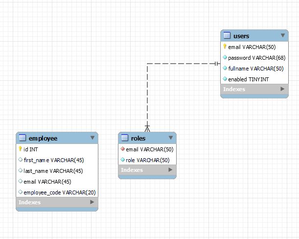

# CRUDSAMPLE
This is a REST service developed with Spring Boot to implement a Employee CRUD application as a sample project. This is intended to
showcase of my skills in Java and its framework, also this let me make some tests of different features or technologies that comes to my
mind while i code with a cup of coffee☕☕.

## Description
As i mentioned before, this is a sample project that implements a RESTful API for consume and manage employee data. I will make updates
to my project as i learn new things or test new features, so this is not a final version of the project, but a work in progress.

This project demonstrates:
- Basic CRUD operations (Create, Read, Update, Delete) for Employee entities.
- Integration with a MySQL database.
- Use of Spring Boot for building RESTful services.
- Basic error handling and validation. (Not complete yet)
- Basic unit and integration tests using JUnit and Mockito. (Not yet)
- Secure endpoints with JWT authentication.

## 🛠 Compiled on
- Java 17
- Maven 3.9.10 (by Maven Wrapper 3.3.2)
- Spring Boot 3.5.3
- Intellij IDEA Ultimate Edition 2025

## 🔧 Future Improvements
- Add PUT, PATCH and DELETE endpoints for Employee entities. (✔️Done Partially, PATCH not yet)
- Add unit tests for all services and controllers.
- Add integration tests for the entire application.
- Add a Dockerfile to containerize the application. (✔️Done)
- Add swagger documentation for the API. (✔️Done)
- Add integration with a MySQL instance in Azure (via SDK or Spring Cloud).

## 🗄️ Database schema


- employee table: stores employee data such as first name, last name, email and its code in the company.  
- users: stores user credentials for authentication.  
- roles: stores user roles for authorization.

## 🗄️ Users and Roles

|  Email             | Password     | Enabled | Roles assigned |
|--------------------|--------------|---------|---------------|
| testUserD@gmail.com | Password123 | 1       |EMPLOYEE, ADMIN|
|pepe_v@gmail.com | Password123 | 1       |EMPLOYEE|

| Endpoint | EMPLOYEE | MANAGER | ADMIN |
|----------|----------|---------|-------|
| GET /api/v1/employees | ✔️       | ✔️       | ✔️     |
| GET /api/v1/employees/{id} | ✔️       | ✔️       | ✔️     |
| POST /api/v1/employees | ❌        | ✔️       | ✔️     |
| PUT /api/v1/employees/update | ❌        | ✔️       | ✔️     |
| DELETE /api/v1/employees/{id} | ❌        | ✔️       | ✔️     |

## 🚀 How to run this project locally
Install JDK17 (you can use your IDE built-in JDK), then also install Docker and Docker Compose if you want to run the MySQL database in a container.

Now clone my project to your local machine:
```
git clone https://github.com/ldelzo18/crudsample.git
```
Then on your IDE, or in a your terminal, navigate to the project root directory and run the following command:
```
docker-compose up
```
Now you can run and consume my test endpoints using Postman or any other API client, or you can run the application directly from your IDE.

## 🌐 Postman collection and endpoints

1. Access to http://localhost:8080/swaggerdoc.html
2. Execute POST auth request to generate a token by using the credentials:
   - email: testUserD@gmail.com
   - password: Password123  
    This will return a token which you can use to access the other endpoints.

3. Try out the following endpoints:
   - GET /api/v1/employees: Get all employees.
   - GET /api/v1/employees/{id}: Get employee by ID.
   - POST /api/v1/employees: Create a new employee.
   - PUT /api/v1/employees/update: Update an existing employee.
   - DELETE /api/v1/employees/{id}: Delete an employee by ID.

4. Enjoy!
